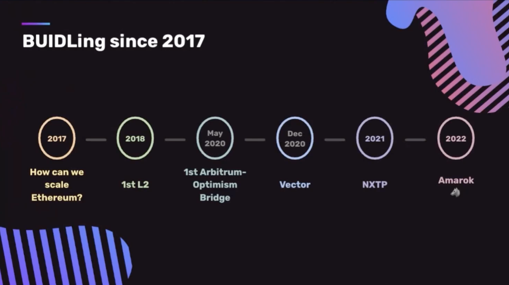
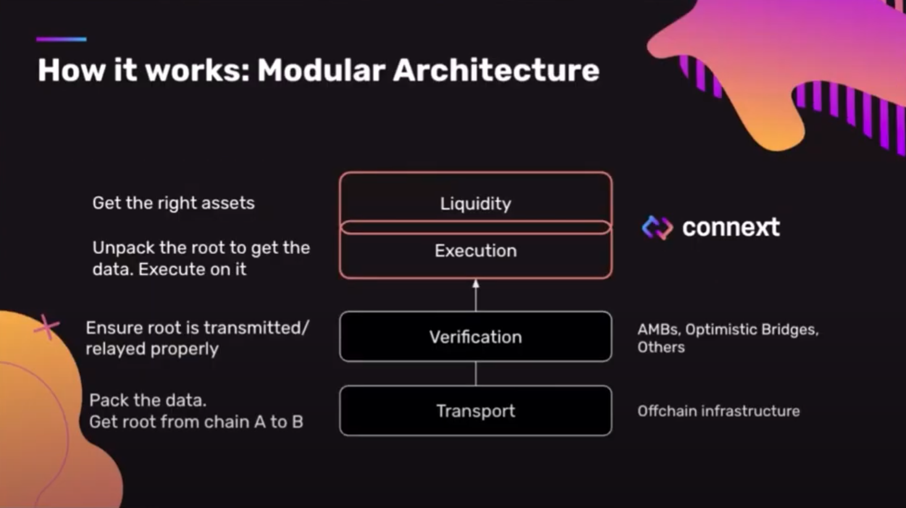
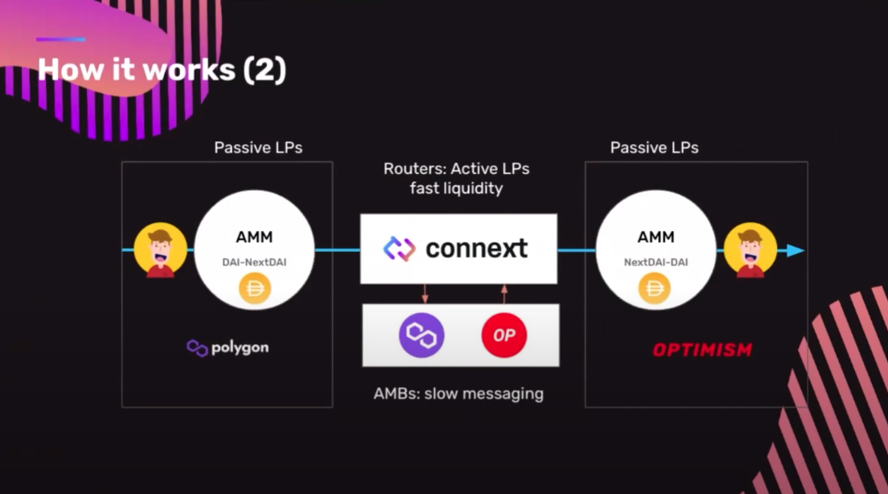
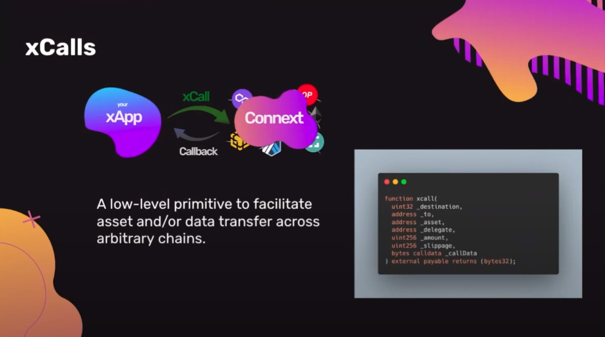
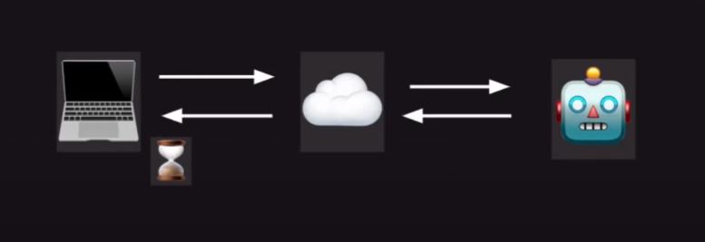
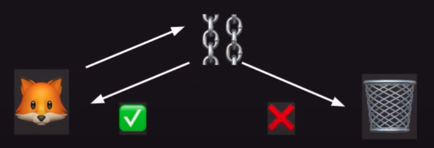
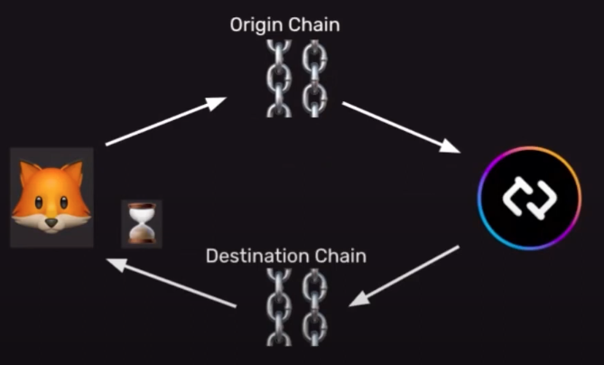
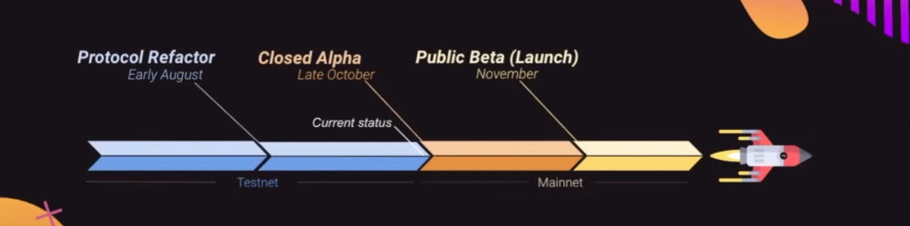
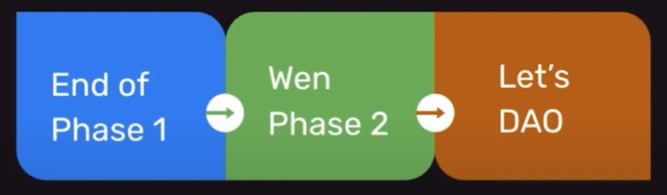

<h1>  Connext Community Call #1 </h1>

This is the very first Community Call on Connext, announced after the end of Community Program Phase 1.

## 🗒 Agenda
1. [Who is Connext](#🔎-who-is-connext)
2. [Amarok is Coming](#🐺-amarok-is-comming)
3. [Community](#🎏-community)
4. [Q&A](#qa)

## 🔎 Who is Connext?

 <b>🛠 BUIDLing since 2017</b> 

> _this session was moderated by [Arjun](https://twitter.com/arjunbhuptani)_

#### 2017
Connext team have jumped into the blockchain space and have been BUIDLing since 2017. "We built Connext because we want to bring blockchains to the broader comsumer public. This is something that people hadn't even begun to think about. The ETH price was around 20-30 USD at the time", said Arjun. This is the question that leads to the thesis of **blockchain scalability**.

#### 2018
With the goal of solving **blockchain scalability**, the team became one of the first L2 R&D Team. Arjun and the team have built the first layer-2 on Ethereum, which was the [State Channel Networks](https://ethereum.org/en/developers/docs/scaling/state-channels/) designed for payments. Later, the team have worked with other L2 teams such as OmiseGO team, Matic team.

#### 2020
In 2020, the community the market started to realized that Roll-ups were going to be the future of scalability. At this point, Connext team saw that communication between  is necessary and have built a very first Arbitrum-Optimism bridge called [Spacefold](https://github.com/connext/spacefold) as a POC. This is the very first trust-minimized cross-chain bridge for rollups.

By the end of 2020, the team have built the early implementation of scalability solution targeted for payment that can do cross-chain transfer called [Vector](https://github.com/connext/vector). The team have worked with many projects in the ecosystem. Around this time, the team have been collaborating with [1Hive](https://1hive.org/) have built a POC bridge that later become **xpollinate** (The old name of Connext Bridge, read more [here](https://blog.connext.network/xpollinate-is-now-connext-bridge-d294baea94c2)).

#### 2021
Later in 2021, the team were able to ship NXTP, which is a more stable implementation of the network. At that time, the NXTP is quite unstable, most assumption on liveliness of routers, stability, etc. are incorrect. This cause the team to take more that a year for the upcoming upgrade to the network. This new updates will solve the existed issues, and even improve the stability as well as allows generalized communication among chains.

#### 2022
That update is the Amarok upgrade 🐺

 <b>🤔 Why Connext?</b> 

> _this session was moderated by [Arjun](https://twitter.com/arjunbhuptani)_

There're key principles that Connext helped shape how Connext is. The very first key principle in designing Connext Network was the **Security**

> 🔒 Security

The team focus on the security as the first priority and have been doing this for 5 years of building Connext.

One of the key realization is that the Web3 space move very quickly that it's not a good idea to bet on any single structure of security model. Thus, this lead us to the second and third principle which are **Modularity**, **Extensibility**, and **Future-Proof**

> 🧩 Modularity 
🔌 Extensibility 
📡 Future-Proof

_Modularity_ allows the design of infrastrusture to composed of different module that is easy to plug-in and plug-out. This allows the network to be able to adapt with the new technology and robust to changes.

_Composability_ is the key principle that make Connext easily integrated with different blockchains with minimal effort. The future of Connext is to build a xApps that would live on multiple chains. The concept of how users acknowledge which chains they're on would be removed.

The last key value of Connext is the **Ease of Implementation**

> 🌈 Ease of Implementation

The _Ease of Implementation_ for Connext allows the experience of building on Connext seamless.

## 🐺 Amarok is Comming

 <b>🐺 Amarok</b> 

> This session was moderated by [Layne](https://twitter.com/laynehaber)

In the upcoming Amarok upgrade, there's going to be several new features listed below:
- **🖱 1 click UX** - The current version required user to sign before releasing tokens. This is worse in term of UX. Amarok upgrade remove this procedure.
- **⛲️ Better Liquidity** - Currently, Connext routers provides LP on two chain side, this requires routers to always rebalance an asset when the demand is high on one specific chains.
- **🤑 Cheaper & Faster txs** - The Amarok upgrade allows the cross-chain transaction to be initialized on source chain and complete on destination chain. This simplies the process and make cross-chain transaction faster and cheaper.
- **🤖 Arbitrary Message Passing** - This is not available in NXTPv0 as the information can assign a financial values. With Amarok, people can build apps that can communicate with arbitrary message.

 <b>🪢 How it works: Modular Architecture</b> 

> This session was moderated by [Layne](https://twitter.com/laynehaber)

Arjun have mentioned about modular architecture in [`🤔 Why Connext?`](#why-connext) section. Connext abstract cross-chain communication into different module as seen in figure below.

- `Transport Layer` - Defines how to get data from chain A to B. Connext use a messaging system that use the default rollup bridges in a [hub and spoke model](https://0xpostman.medium.com/honk-if-you-like-hub-spoke-7b55cba84c0d) to pass a data through from origin chain, to hub, to the destination spoke.
- `Verification Layer` - Evalate the veracity of the message from chain A to B. By default, Connext will use Optimistic Bridge. With the modular design, the verification layer can be changed depending on the path. For example, if we bridge Ethereum to IBC, the first leg would use Optimistic Bridge as a verification layer while on Cosmos use IBC verification.
- `Execution Layer` - This layer packs messages and defines how the message will be put into the transport and verification layer.
- `Liquidity Layer` - Providing a easy-to-use interface for developers and managing asset complexity. This allow users to receive the token that is mainly used on the destination chain apart from the minted asset (e.g. USDC instead of anyUSDC or nextUSDC). This is the layer that user interacted with.

When we put the transaction lifecycle together, we get the following picture:

Let's look at the Polygon<>Optimism bridge transaction. 
1. User send DAI to the liquidity layer via `xcall` function.
2. DAI is then swap to NextDAI and burn.
3. The message was sent to the Optimism AMB directly to contract on Ethereum. The messages from all of the connected Spokes then push them back out to the destination chain.
4. Optimism AMB push the message to the Optimism chain, ready to be executed.
5. NextDAI was minted on the Optimism and swapped back to DAI for user on Optimism.

No matter what ecosystem users are in, the user experience remains the same. For example, we use AMB on the rollups within Ethereum. But if we change the ecosystem to Cosmos, then we use IBC instead. Similarily, on Polkadot will use XCMP. This is the benefits of using a modular architecture as we can plug-in components in and out to support different communication channel on different chains.

 <b>📞 xCalls</b> 

> _this session was moderated by [Rahul](https://twitter.com/rhlsthrm)_

What Connext wanted to do is to build a infrasturcture for people to make use of it instead of building a UI application. The only thing that developer have to learn to connect their apps is a function call `xcall`. 

This `xcall` is very similar to solidity native function `call`. The difference is that `xcall` was designed to do the cross-chain transaction via Connext. The process can be simplifies as shown in the figure above.
- xApp (cross-chain Apps) called `xcall` into Connext.
- Connext takes care of bridging, AMBs, routing, etc. and call some function on some chain.
- Get the data back to xApp in a form of callback.

 <b>🪛 xApps are the Future</b> 

> _this session was moderated by [Rahul](https://twitter.com/rhlsthrm)_

What can be made possible with **xApps**?

- **💰 xchain DeFI**
    - Most DeFI protocols are already go multichain. However, Connext think that the fact that users need to change the chains in order to interact with the chain normally is not a good UX. 
    - The application itself should handle all this steps by themselve. Connext allow the apps to abstract this concept out and make this possible.
    - Severa xchain DeFi includes 
        - **xchain DEX**: Any chain to any chain swap (e.g. LiFinance).
        - **xchain Lending**: Deposit on chain A, borrow on chain B.
        - **xchain Yield Aggregator**: Rebalance vault accross different chains, easily chasing for yields.

- **🎨 xchain NFTs**
    - Developer can use Connext to held NFT escrow on one chain and mint NFT on any other chain.
    - Cross-chain NFT can be used for many purposes
        - New mints on L2, move to L1 for security
        - Provide NFT as collateral on demand
        - etc.

- **🪜 xchain Infra**
    - Most tools can be expand to cross-chain with Connext. Several use cases includes:
        - xchain DAO Tooling for governance & more
        - xchain oracles
        - xchain tools: wallets, identity systems, ...

 <b>📟 Asynchronous Communication</b> 

> _this session was moderated by [Rahul](https://twitter.com/rhlsthrm)_

How does communication works in the cross-chain world?

Generally, when users interacted with internet, the communication is asynchronous. For example, when accessing any website, the user is connected to the server some where and return the data at some point.

On the blockchain, this is very different. Let's say you are using Metamask, you send the transaction on the blockchain, you know if the transaction works right away. If the transaction doesn't work, it reverts automatically. This is a synchronous communiucation where every communication is either passed or failed prior execution.

Unlike asynchronous communication, if something doesn't behave properly, it needs to be handle via callback on the other places.

Basically, what Connext is doing is we alluded to the callback pattern at the start.. We provide a way to have asynchronous communication on Solidity and within the smart contract.

With Connext, developers can send message on origin chain. Then Connext will give the ability to execute something on the other chains before sending the data back so that callbacks can be handled.

The current reason why adoption of the cross-chain app is slow because of the complexity of the interfaces and asynchronous communication pattern. Connext try to solve this problem by using a simplify `xcall` function, and the callback handling method for async communication.

 <b>🎯 Path to Mainnet</b> 

> _this session was moderated by [Alex]()_

- _Early August_: Refactoring to Hub-and-Spoke model discussed earlier
- **Currently** (19/10/2022): The team is really close to launch the mainnet.
- _Late October_: Closed Alpha, a close launch for internal only. This is to test on the partner devs and security of the protocol
- _November_: Public Beta, the mainnet launch. The team is expected to launch the Amarok on around mid November.

On the **Beta Launch**, Connext will these chains as a starting point support:
- Ethereum
- Optimism
- Polygon
- Gnosis
- Arbitrum
- BNB Chain (BSC)
- zkSync (TBD)

The network will support main stablecoins such as USDC. **There are a lot of chains/assets in the list that we will integrate in the future**.

Connext is also looking forward to other opportunities such as:
- xApp partnerships
- Chain/ecosystem and asset expansions
- Ensbling mass adoption of a multichain future

 <b>💻 Connext Hacker House @ EthIndia</b> 

> _this session was moderated by [Matthew]()_

Connext will attend EthIndia and host Connext Hacker House in that event.

Apply the hackathon [here](https://connext.network/hackerhouse) now! (Application Deadline 28th October).

## 🎏 Community

 <b>🪪 Contributor Program</b> 

> _this session was moderated by [Arjun](https://twitter.com/arjunbhuptani)_

Contributor program is the program to incentivize community to build Connext in a different way. For example building infrastructure, running testnet routers, creating a marketing content, and so on. The Phase 1 of the community program ended a while ago and have the final results available. The results will be announced at around next week after the team finish developing the discord bot.

### 🗓 What about Phase 2? 

The team have underestimate the amount of participants significantly. This cause the team to have more submission than expected, and the submission were checked individually by the moderators.

Therefore, the team is looking at the problem from Phase 1 and make sure that these problems won't persist on Phase 2.

### 🕋 The Connext DAO
One of the key idea of the contributor is to distribute the token to the contributors. The goal toward this is to seating the initial community that will become the part of the DAO in the early stages.

 <b>🔫 Wen token?</b> 

> _this session was moderated by [Arjun](https://twitter.com/arjunbhuptani)_

The team announced the Amarok upgrade at around March-April 2022. One of the big thing was that the team needs to rearchitect the way system work. Additionally, Connext is also working with Nomad for this upcoming update.

The team underestimate how long coordination between two teams are, and decided to do contributor program in parallel to the new architecture implementation. "I think this is a mistake", said Arjun in the community call. "I'll be completely honest, like we shouldn't have parallel the process. I think that was something that in hindsight, I'm realizing as a lean young organization, it's a bad idea to do multiple things in parallel."

So what's up with the token? Currently, Amarok is in the tail end of being completed. The process was unfortunately delayed due to the [Nomad hack incident](https://techcrunch.com/2022/08/02/nomad-chaotic-exploit-crypto/), and rethink the strategy around messaging system while get audited from scratch.

Beyond that, the token launch itself is going to be stalled for now regarding to the reason mentioned above. The token launch will be focused once the Amarok upgrade is delivered and stable.

###  📜 Philosophy of Connext's DAO
The philosophy of Connext is quite different from other protocol's DAO. The team believe that Connext is a public infrastructure, unlike other protocols that see the network as a company. Connext goal is to build an ecosystem, not the organization. The team want Connext to be built like the internet where people are contributing together to the public infrastructure.

## 📌 Q&A

## 🌊 Author
`chompk.eth | Contribution DAO#9502`